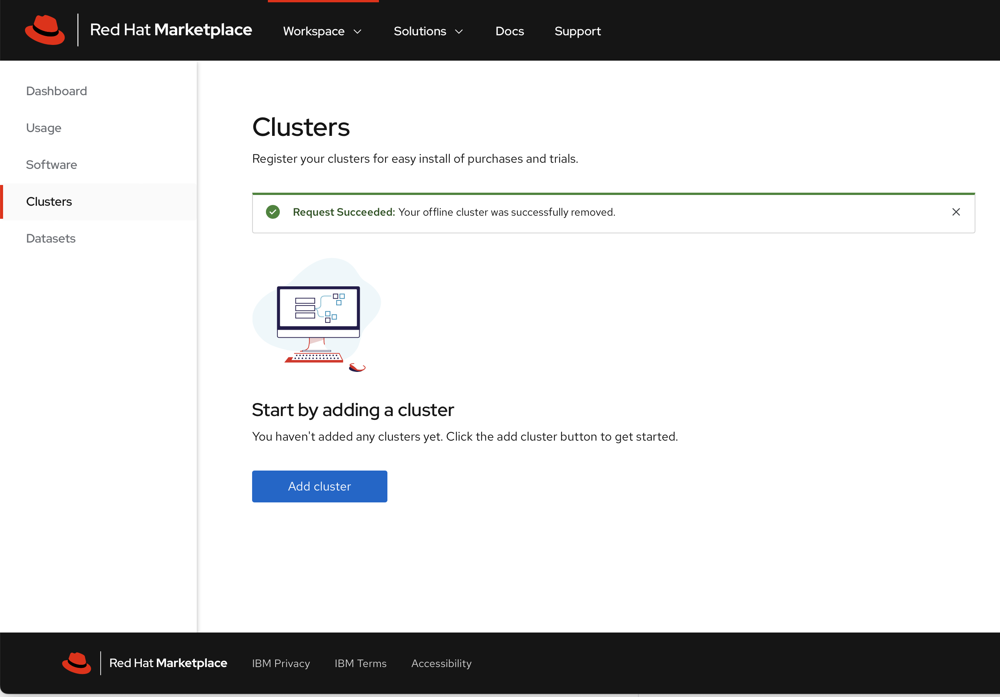
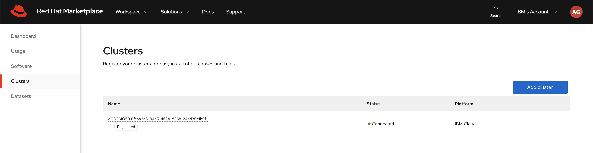
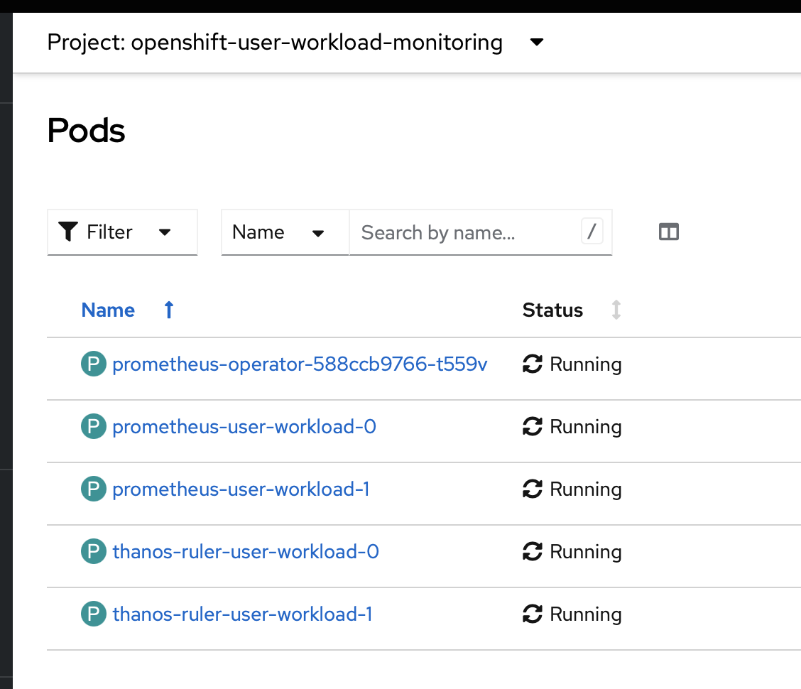
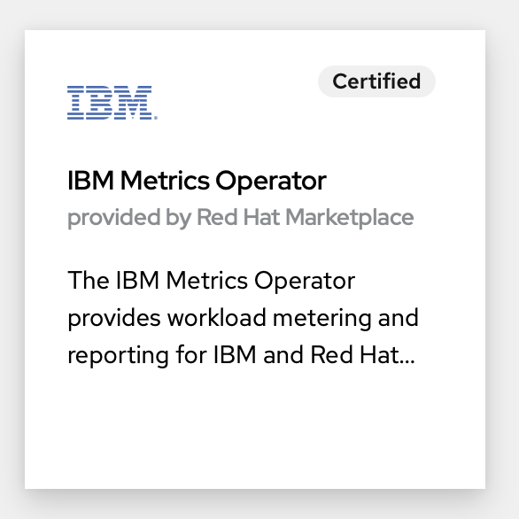
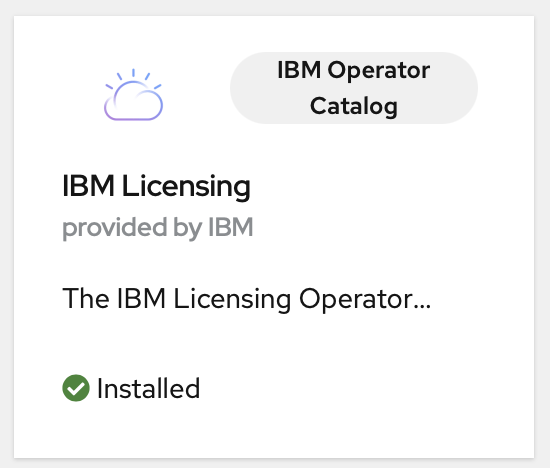
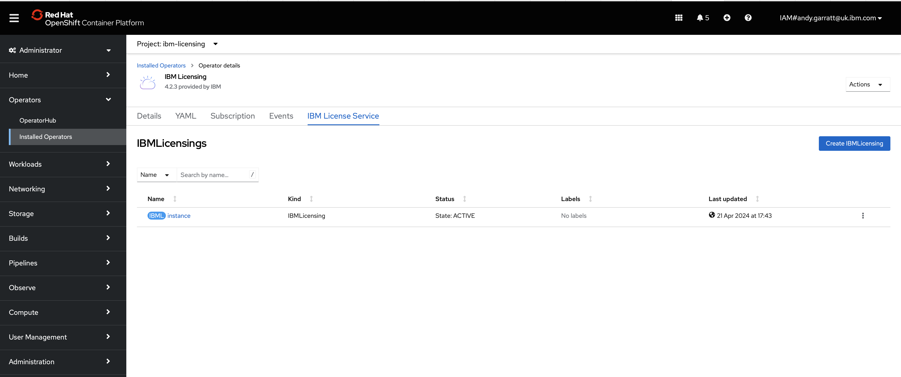
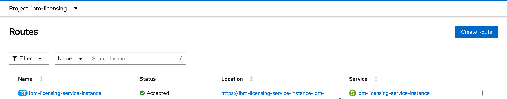
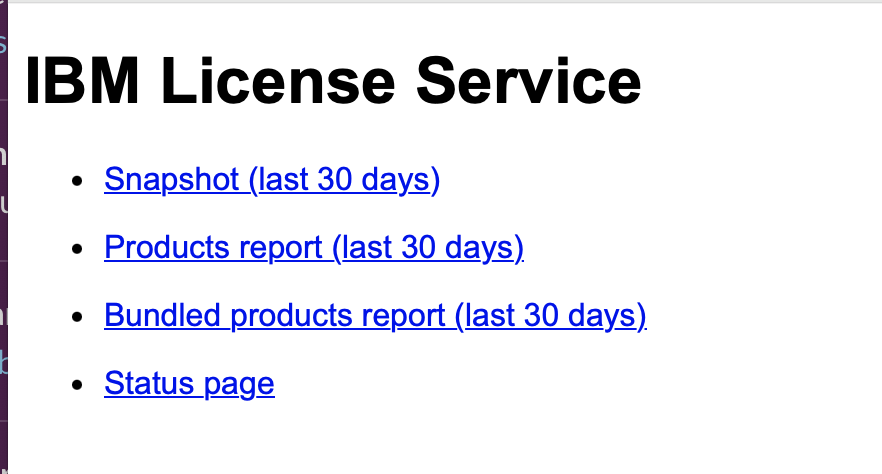
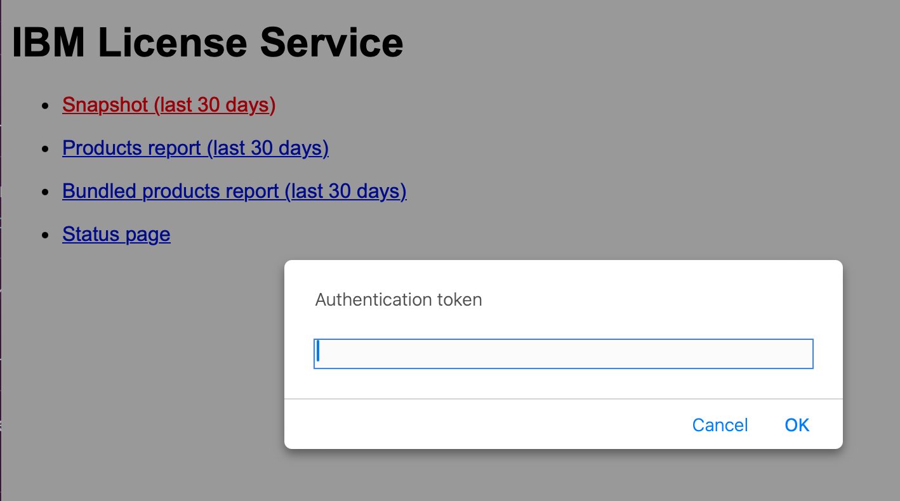
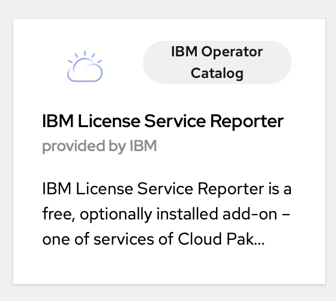

# Redhat MarketPlace

Log into Marketplace here: https://marketplace.redhat.com/en-us

First thing is to register your cluster with the Marketplace.

Go to `Workspace -> Clusters` and `Add Cluster`


Now follow the 'Register Cluster' steps..these are pretty good in the RedHat site - it's easiest just to follow their docs and copy/paste the steps as the commands (and parameters) are automatically populated for you.

This is what they're doing for reference

Generate the pull secret

Create a redhat-marketplace namespace
`oc create namespace redhat-marketplace`

Create a marketplace subscription (nstall the Redhat Marketplace operator)
`oc apply -f "https://marketplace.redhat.com/provisioning/v1/rhm-operator/rhm-operator-subscription?approvalStrategy=Automatic"`

Create RedHat secret with your pull secret value
`oc create secret generic redhat-marketplace-pull-secret -n redhat-marketplace --from-literal=PULL_SECRET=<<YourPullSecret>>`

Accept the license
`oc patch marketplaceconfig marketplaceconfig -n redhat-marketplace --type='merge' -p '{"spec": {"license": {"accept": true}}}'`

Update the global pull secret:
`curl -sL https://marketplace.redhat.com/provisioning/v1/scripts/update-global-pull-secret | bash -s <<Yoursecret>>`

Should look like this:



### Enable Monitoring for user defined projects:

(This should have been done for youin later OCP versions and you should not need to do this)

https://docs.openshift.com/container-platform/4.12/observability/monitoring/enabling-monitoring-for-user-defined-projects.html

Edit the `cluster-monitoring-config` config map
```
apiVersion: v1
kind: ConfigMap
metadata:
  name: cluster-monitoring-config
    namespace: openshift-monitoring
data:
  config.yaml: |
    enableUserWorkload: true
```

Edit the `user-workload-monitoring-config` config map in the `openshift-user-workload-monitoring` project
```
apiVersion: v1
kind: ConfigMap
metadata:
  name: user-workload-monitoring-config
  namespace: openshift-user-workload-monitoring

data:
  config.yaml: |
    prometheus:
      retention: 168h
      volumeClaimTemplate:
        spec:
          resources:
            requests:
              storage: 40Gi
```

Check the following pods are running:
`prometheus-operator`, `prometheus-user-workload` and `thanos-ruler-user-workload` pods are running in the `openshift-user-workload-monitoring` project



## Installing the IBM Metrics Operator
(This should have been already installed from the steps above in the Redhat Marketplace - again, for reference)

Install the IBM Metrics operator from the OperatorHub:



Just install and take the defaults - install to redhat-marketplace

## Installing the License Operator

You will need to do this - follow the instructions in this link: https://www.ibm.com/docs/en/cloud-paks/cp-integration/16.1.0?topic=administering-deploying-license-service

Get the license service operator from the Operator hub



Create an instance of the license service - when you do this, it's OK that it doesn't install in 'all namespaces' - it will still find all of your deployments.



## Viewing License Information
You can use the License Service Reporter (below) - or you can go directly into the license service...

You'll need to get the route (URL) to the license service - to get this:

Go to `Networking -> Routes` and select the namespace that you installed the license service into.

You'll see a Route called `ibm-licensing-service-instance` - the URL you need for your browser is in the 'Location' field - you can just click on it - or save it for future use.


This should then take you to the License Service UI


To use this, you'll need a token - if you click on any of the links, you'll be prompted for it:


This token is stored in a secret - to get it, go to `Workload -> Secrets` in the namespace you installed the license service into - you'll need a secret called `ibm-licensing-token`. If you're in the OpenShift UI, click on 'reveal values' and there's your token!


## Installing the License Service Reporter



TBD
